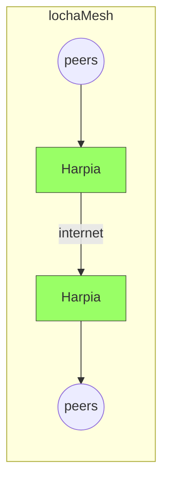

# locha-mesh-app
Central application of locha mesh network

## ¿Que es locha?

La  idea del proyect **locha** parte de tres puntos fundamentales; privacidad, resistencia a censura y la no siempre disponibilidad de acceso a una infraestructura para la transmisión de datos.
Existen soluciones similares en el mercado para mensajería de texto o cartera Bitcoin, pero entendemos que, hay un handicap difícil de superar en aquellos lugares que de verdad serían necesarios, ya sea por coste, falta de transporte o cierre de fronteras.

El total de la infraestructura necesaria para el correcto funcionamiento está formada por los propios nodos en una topología mesh[(1)](https://en.wikipedia.org/wiki/Mesh_networking), estos, sobre los que actualmente estamos trabajando y denominamos, Turpial[(2)](https://) y Harpia[(3)](https://).

Ambos ofrecen la funcionalidad de peer, pero por cuestiones técnicas, como es capacidad de procesamiento, RAM disponible, almacenamiento en disco ó conectividad, Harpia ofrece capacidad extendida además de peer, como puede ser push de transacciones a la red Bitcoin[(4)](https://) o servidores Electrum[(5)](https://), interconexión lochaMesh-lochaMesh(img.a) a través de internet, etc.

img.a interconexión lochaMesh~lochaMesh

## ¿Como funciona?
Idealmente una red en topología mesh:
- Todos son peers: no existe categorización cliente, servidor.
- Todos cooperan:
- Auto-organización:
- Auto-configuración: distribucion dinámica de carga de trabajo. (dynamic workload)
- Interoperable entre diferentes dispositivos actuales o futuros (vendor agnostic)

---
##### Renuncia de responsabilidad
El software se encuentra en una etapa muy temprana, actualmente estamos portando las fuentes,
desde el repositorio privado al este público, por lo que no puede considerarse en ningun caso estable.

***

Este software se encuentra bajo la licencia MIT, se adjunta por lo tanto una copia de la misma [aquí](https://github.com/btcven/locha-mesh-app/blob/master/LICENSE)
 
