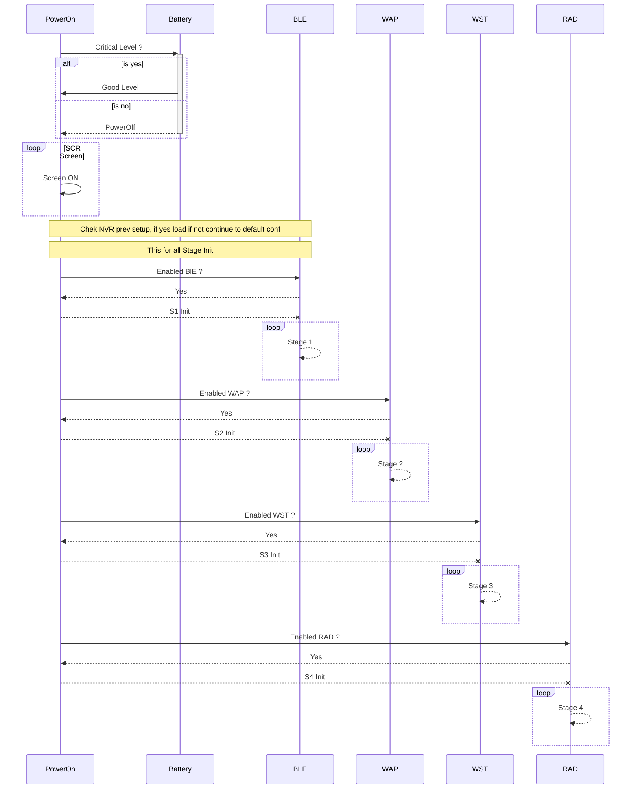

## First Boot

The fist boot it's a initial stage of bootstraping, thant one lora mesh device have to do.

This stage it's about to set the basic configuration settings for the use of device on the mesh network

In the next image you can view the step of this process

The process:

