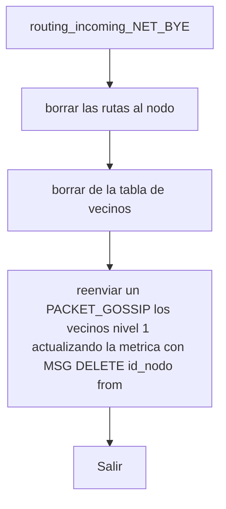

## Locha routing - Algo for incoming packets type : NET_BYE

```mermaid
graph TD
A[routing_incoming_NET_BYE]  -->B[borrar las rutas al nodo]
B -->C[borrar de la tabla de vecinos]
C--> E[reenviar un PACKET_GOSSIP los vecinos nivel 1 actualizando la metrica con MSG DELETE id_nodo from]
E -->H[Salir]
```