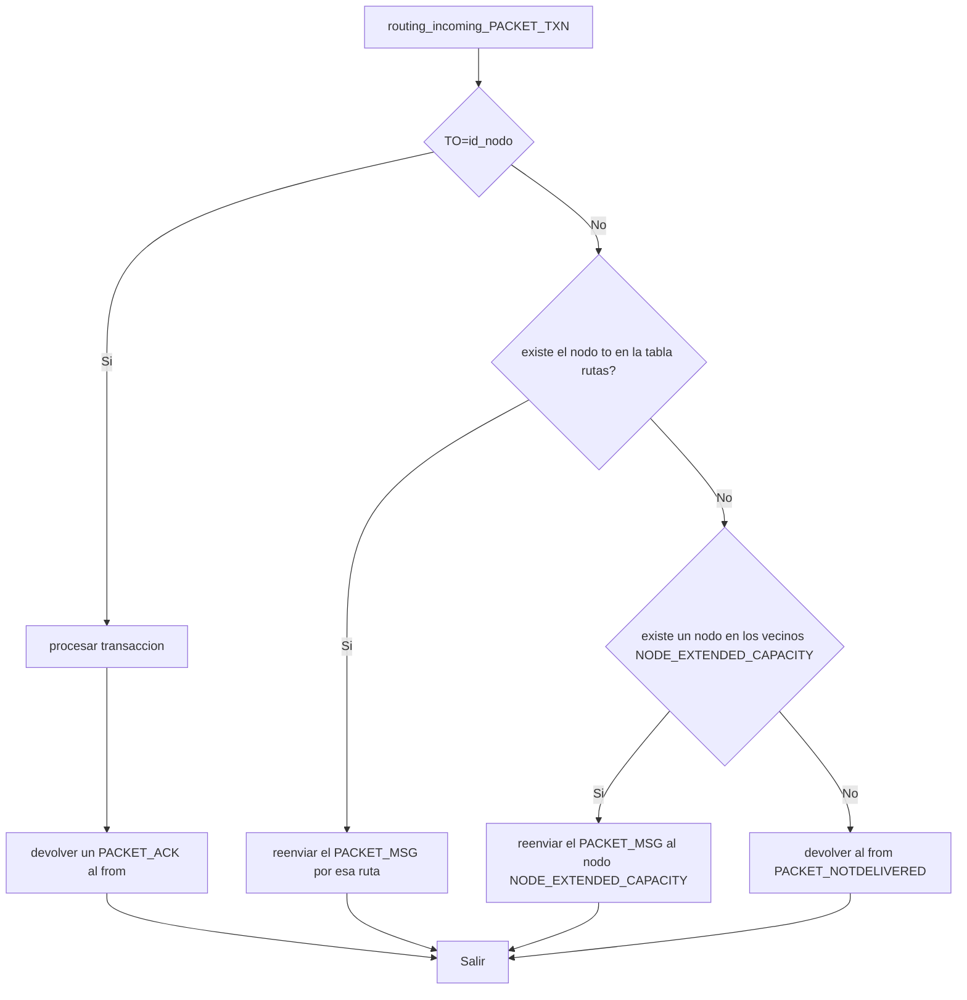

## Locha routing - Algo for incoming packets type : PACKET_TXN

```mermaid
graph TD
A[routing_incoming_PACKET_TXN]  -->B{TO=id_nodo}
B -->|Si|C[procesar transaccion ]
G -->|No|D{existe un nodo en los vecinos NODE_EXTENDED_CAPACITY}
G -->|Si|I[reenviar el PACKET_MSG por esa ruta]
D -->|Si|J[reenviar el PACKET_MSG al nodo NODE_EXTENDED_CAPACITY]
D -->|No|K[devolver al from PACKET_NOTDELIVERED]
C--> E[devolver un PACKET_ACK al from]
B-->|No|G{existe el nodo to en la tabla rutas?}
E -->H[Salir]
I -->H
J -->H
K -->H
```